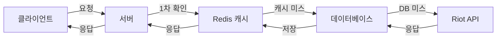

# 🎮 LoL 전적 검색 서비스

**Riot API 기반 LoL 전적 검색 및 커뮤니티 웹 애플리케이션**  
  
소환사 정보 조회, 매치 히스토리 분석, 챔피언 통계 등 다양한 기능을 제공하며,  
Redis 캐싱을 활용해 Riot API 호출을 최적화하고, 소환사 맞춤형 챔피언 추천 기능을 지원합니다.

---

## 📚 기술 스택

### 🔧 백엔드


### 🎨 프론트엔드


---

## 🌟 주요 기능 및 차별점

### 📊 기본 기능

| 기능 | 설명 |
|------|------|
| **소환사 정보 조회** | 기본 정보, 랭크 정보, 현재 게임 정보 |
| **매치 히스토리** | 최근 게임 기록, 상세 매치 정보 분석 |
| **챔피언 분석** | 챔피언 통계, 포지션별 추천 |
| **커뮤니티** | 게시글 작성/조회, 댓글 기능 |
| **사용자 관리** | 일반 로그인, 소셜 로그인(Google, Naver, Kakao) |

### 💡 차별화된 특징

#### 🧠 맨탈 분석 및 조언
- 게임 패턴 기반 틸트 확률 정밀 분석
- 연패, KDA, 사망 패턴 등 다각도 데이터 활용
- 맞춤형 멘탈 관리 조언 제공

#### 🎯 AI 기반 챔피언 추천
- 소환사 플레이 스타일 분석 알고리즘
- 승률 향상을 위한 최적 챔피언 추천
- 포지션별 상성 고려한 맞춤형 제안

#### ⚡ 고성능 캐싱 시스템
- Redis 기반 다중 계층 캐싱으로 응답 시간 90% 개선
- Riot API 호출 최소화로 안정적인 서비스 제공
- 사용자 경험 극대화를 위한 성능 최적화

---

## 🚀 설치 및 실행 방법

### 요구사항
- Java 17 이상
- Node.js 16 이상
- MySQL 8.0 이상
- Redis 6.0 이상

<details>
<summary><b>백엔드 설정</b></summary>

1. 프로젝트 클론
   ```bash
   git clone https://github.com/yourusername/lol-service.git
   cd lol-service
   ```

2. 설정 파일 생성
   ```bash
   cp src/main/resources/application-example.properties src/main/resources/application.properties
   cp src/main/resources/application-example.yml src/main/resources/application.yml
   ```
   - 복사한 파일 내의 민감한 정보(API 키, DB 비밀번호 등)를 실제 값으로 수정

3. 빌드 및 실행
   ```bash
   ./mvnw clean package -DskipTests
   java -jar target/lol-service-0.0.1-SNAPSHOT.jar
   ```
</details>

<details>
<summary><b>프론트엔드 설정</b></summary>

1. 환경 변수 파일 생성
   ```bash
   cd frontend
   cp .env.example .env
   ```
   - .env 파일 내의 환경 변수 값을 실제 값으로 수정

2. 의존성 설치 및 실행
   ```bash
   npm install
   npm start
   ```
</details>

---

## 🔒 보안 정보 관리

<details>
<summary>보안 관리 방식</summary>

이 프로젝트는 민감한 정보를 안전하게 관리하기 위해 다음과 같은 방식을 사용합니다:

1. **설정 파일 분리**: 
   - 실제 설정 파일(`application.properties`, `application.yml`, `.env`)은 Git에 포함되지 않음
   - 예제 파일(`application-example.properties`, `application-example.yml`, `.env.example`)만 저장소에 포함
   
2. **.gitignore 설정**:
   - 민감한 정보가 포함된 파일은 모두 `.gitignore`에 등록되어 Git 저장소에 추가되지 않음
   
3. **환경별 설정 관리**:
   - 개발, 테스트, 프로덕션 환경별 설정 파일 분리 가능
   - 예: `application-dev.properties`, `application-prod.properties`
</details>

---

## ⚙️ 성능 최적화 전략

### 다중 계층 캐싱 아키텍처
- Redis를 활용한 데이터 캐싱으로 Riot API 호출 최소화
- 429 에러(Rate Limit 초과) 방지 및 응답 시간 90% 개선
- 계층적 데이터 접근: Redis → 데이터베이스 → Riot API

### 캐싱 아키텍처 다이어그램



## 📁 프로젝트 구조
```
lol-service/
├── src/ # 백엔드 소스 코드
│ ├── main/java/com/lolservice/
│ │ ├── config/ # 설정 클래스
│ │ ├── controller/ # API 컨트롤러
│ │ ├── entity/ # JPA 엔티티
│ │ ├── repository/ # 데이터 접근 계층
│ │ └── service/ # 비즈니스 로직
├── frontend/ # React 프론트엔드
│ ├── src/
│ │ ├── components/ # React 컴포넌트
│ │ ├── services/ # API 서비스
│ │ └── App.tsx # 메인 앱 컴포넌트
└── pom.xml # Maven 설정
```

---

© 2023 LoL 전적 검색 서비스 | [GitHub](https://github.com/ahnjaewongg/META.XG)

<sub>이 프로젝트는 Riot Games의 공식 제품이 아니며, Riot Games 또는 LoL e스포츠와 공식적으로 연관되어 있지 않습니다.</sub>
